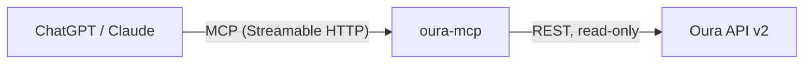

# oura-mcp

[](https://github.com/Rajskij/oura-mcp/actions/workflows/ci.yml)
[](https://github.com/Rajskij/oura-mcp/pkgs/container/oura-mcp)
[](LICENSE)
[](package.json)

**Ask your Oura Ring anything. In ChatGPT or Claude, in any language.**

A remote MCP server that connects Oura Ring data to any MCP client. No UI, no app, no model of its own: the assistant you already pay for calls the tools and explains your data in whatever language you speak.

> **You:** how did I sleep this week?
>
> **ChatGPT:** Your week was uneven, averaging 65/100. Best night was June 29 (77) with strong deep sleep. The rough one was July 2 (47): little REM, low efficiency, and your bedtime drifted way off schedule. The main pattern to fix is sleep timing.

**Get started in two clicks:** download [`oura-mcp.mcpb` from the latest release](https://github.com/Rajskij/oura-mcp/releases/latest) and double-click it — Claude Desktop installs the extension, and **demo mode works instantly with zero setup** (fake sample data, no Oura account needed). Connecting your own ring takes ~5 minutes: [Run locally](#run-locally-claude-desktop--easiest-start).

Things to try once connected:

```text
Should I train hard today or take it easy?
Compare my sleep on workdays vs the weekend.
Did the late coffee I tagged yesterday show up in my night heart rate?
Какой у меня был пульс сегодня днём?
```

## How it works



One small Node.js process, stateless — a fresh MCP server instance per request. The client model picks the right tools, the server returns compact, pre-shaped JSON, the model does the talking. Curious how it's put together and why? See [docs/ARCHITECTURE.md](docs/ARCHITECTURE.md).

**When you don't need this:** if you want dashboards and charts, the Oura app already does that; if you want raw data for scripts, call the [Oura API](https://cloud.ouraring.com/v2/docs) directly. This server exists for one thing: making your ring data conversational in the chat client you already use.

## Tools

| Tool | Ask things like |
|---|---|
| `oura_get_sleep` | "How did I sleep this week?" |
| `oura_get_sleep_detail` | "When did I fall asleep? How much deep sleep? Night heart rate?" |
| `oura_get_readiness` | "Should I train today? Is my temperature elevated?" |
| `oura_get_activity` | "How many steps and calories yesterday?" |
| `oura_get_stress` | "How stressed was I on Monday?" |
| `oura_get_vitals` | "What's my SpO2, VO2 max, cardiovascular age?" |
| `oura_get_workouts` | "How was my run? Did I meditate this week?" |
| `oura_get_tags` | "Did coffee affect my sleep?" (reads tags you log in the Oura app) |
| `oura_get_heartrate` | "What was my pulse this afternoon?" (hourly aggregates) |
| `oura_get_profile` | "How charged is my ring?" |

All tools are read-only and marked with `readOnlyHint`, so ChatGPT does not nag you for confirmation on every call.

## Designed for LLMs, not for dashboards

- **Task-oriented tools, not 1:1 endpoint wrappers.** 18 Oura endpoints grouped into 10 tools that match how people actually ask questions.
- **Token-efficient responses.** Durations converted to minutes server-side, units baked into field names (`deep_min`, `efficiency_pct`), raw time series and internal IDs stripped. A tool response is 0.2–3 KB, not 50.
- **`response_format: concise | detailed`** on data-heavy tools. Concise by default, breakdowns on demand.
- **Actionable errors.** A too-wide heart rate query returns "ask for 3 days or less, or use oura_get_readiness for trends", not a 400.
- **Sane defaults.** Every tool works with zero arguments (last 7 days).

## Requirements

- An Oura Ring with an active Oura subscription (the API returns 403 without one) — or nothing at all for the sandbox demo mode
- Node 22+ or Docker
- 5 minutes to register your own Oura OAuth app (below)
- Only for the remote path (ChatGPT, claude.ai web): any host with public HTTPS — a free-tier VM behind Caddy works fine. Avoid free tiers that sleep between requests: ChatGPT times out on cold starts

### Why do I need my own Oura app?

Oura deprecated personal access tokens in December 2025, so an OAuth app is the only supported way to access your data — this is Oura's rule, not this project's. Registering one is free, instant, and needs no review for personal use. It is also the best part of the design: your tokens are issued to *your* app and live on *your* server, so your health data never depends on anyone else's infrastructure — including mine.

## Run locally (Claude Desktop) — easiest start

No server to deploy: Claude Desktop starts oura-mcp itself as a local process.

**Install (two clicks):** download `oura-mcp.mcpb` from the [latest release](https://github.com/Rajskij/oura-mcp/releases/latest), double-click it, press Install. Done — **demo mode** works immediately (fake sandbox data, no Oura account), so you can try every tool before any setup. Claude will remind you the numbers are samples.

**Connect your real ring (~5 minutes):**

1. Create your own Oura app (free, instant, no review) at [developer.ouraring.com/applications](https://developer.ouraring.com/applications) — set the redirect URI to exactly `http://localhost:8888/callback`
2. In Claude Desktop: Settings → Extensions → oura-mcp → **Configure** → paste the app's Client ID and Client Secret (the secret is stored in your OS keychain)
3. Ask Claude a health question — your browser opens the Oura consent page. Approve, ask again, and you're looking at your own data. Tokens stay on your machine (`~/.oura-mcp/`, chmod 600).

Prefer a config-file setup, or using a different stdio client? The docker route works everywhere:

```json
{
  "mcpServers": {
    "oura": {
      "command": "docker",
      "args": ["run", "-i", "--rm", "ghcr.io/rajskij/oura-mcp:latest", "node", "dist/src/stdio.js"]
    }
  }
}
```

Ask Claude "how did I sleep this week?" — you'll get answers from Oura's sandbox data, which is exactly how the real thing behaves.

<details>
<summary><b>Switch to your real account</b></summary>

1. Register an OAuth app at developer.ouraring.com/applications (redirect URI `http://localhost:8888/callback`) and put the credentials in an `.env` file next to a copy of [docker-compose.yml](docker-compose.yml)
2. One-time browser consent, saves tokens to `./data`: `docker compose --profile setup up get-token`
3. Point the same config at your credentials and tokens:

```json
{
  "mcpServers": {
    "oura": {
      "command": "docker",
      "args": [
        "run", "-i", "--rm",
        "--env-file", "/absolute/path/to/.env",
        "-v", "/absolute/path/to/data:/app/data",
        "ghcr.io/rajskij/oura-mcp:latest",
        "node", "dist/src/stdio.js"
      ]
    }
  }
}
```

</details>

Running from source instead of Docker: `npm install && npm run build`, then use `"command": "node", "args": ["/path/to/oura-mcp/dist/src/stdio.js"]` (with `cwd` at the repo so `data/tokens.json` resolves).

## Self-hosting (remote: ChatGPT, claude.ai web)

### Docker (recommended)

```bash
# 1. Register an OAuth app at developer.ouraring.com/applications
#    Redirect URI: http://localhost:8888/callback

# 2. Configure
curl -O https://raw.githubusercontent.com/Rajskij/oura-mcp/main/docker-compose.yml
curl -o .env https://raw.githubusercontent.com/Rajskij/oura-mcp/main/.env.example
# fill in .env: client id/secret, generate MCP_PATH_SECRET (openssl rand -hex 24)

# 3. Connect an Oura account (one-time browser consent on this machine)
docker compose --profile setup up get-token

# 4. Run
docker compose up -d
```

Keep `PORT=3000` in `.env` (or adjust the compose port mapping to match).

<details>
<summary><b>Node, no Docker</b></summary>

Needs Node 22+.

```bash
# 1. Register an OAuth app at developer.ouraring.com/applications
#    Redirect URI: http://localhost:8888/callback

# 2. Configure
cp .env.example .env   # fill in client id/secret, generate MCP_PATH_SECRET

# 3. Connect an Oura account (one-time browser consent)
npm install
npm run get-token

# 4. Run
npm run dev
```

</details>

Want to hack on it without a ring? `OURA_SANDBOX=1 npm run dev` serves Oura's sandbox data, no account needed.

## Connect your chat client

Your MCP endpoint is `https://your-host/mcp/<MCP_PATH_SECRET>`.

<details>
<summary><b>ChatGPT</b> (Plus and above, desktop web)</summary>

1. Settings → Apps → Advanced settings → enable **Developer mode**
2. Settings → Apps → **Create**: name it, paste your MCP endpoint URL, auth = **No auth**
3. In a conversation, open the **+** menu → Developer mode → enable the app

Set up on desktop web; the app then works in mobile conversations too.

</details>

<details>
<summary><b>Claude</b> (web and desktop)</summary>

1. Settings → **Connectors** → **Add custom connector**
2. Paste your MCP endpoint URL → Add

Claude connects from Anthropic's cloud, so the server must be publicly reachable (no localhost).

</details>

<details>
<summary><b>Other clients (Cursor, local-only clients)</b></summary>

Clients that only speak stdio can use the [`mcp-remote`](https://www.npmjs.com/package/mcp-remote) bridge:

```json
{
  "mcpServers": {
    "oura": {
      "command": "npx",
      "args": ["mcp-remote", "https://your-host/mcp/<MCP_PATH_SECRET>"]
    }
  }
}
```

</details>

## Configuration

| Variable | Required | Purpose |
|---|---|---|
| `OURA_CLIENT_ID` | yes | Your Oura app's client id |
| `OURA_CLIENT_SECRET` | yes | Your Oura app's client secret |
| `MCP_PATH_SECRET` | yes | Long random URL path segment (`openssl rand -hex 24`) — the access control for the endpoint |
| `PORT` | no | HTTP port, default 3000 |
| `OURA_SANDBOX` | no | `1` = serve Oura's fake sandbox data, no account needed |

## Troubleshooting

- **403 from every tool** — no active Oura subscription on the connected account. The API requires one.
- **401 / "token expired, needs a reconnect"** — the stored refresh token was lost or invalidated (Oura rotates it on every refresh; never run two copies of the server against the same `data/tokens.json`). Re-run `get-token`.
- **404 when connecting** — the path secret in the URL doesn't match `MCP_PATH_SECRET`. Copy the full endpoint URL again.
- **ChatGPT: "Error creating connector" / timeouts** — your host is asleep. ChatGPT aborts on cold starts (~60 s budget); use an always-on host.
- **`resilience` / `vo2_max` come back empty** — Oura computes these after ~2 weeks of wear / a fitness test; the tools work, the account has no data yet.

## Security & privacy

- OAuth tokens never leave your server; the MCP client only sees tool results.
- Read-only scopes; the Oura API has no write endpoints for health data, and neither does this server.
- Your email is never returned by any tool.
- The optional usage log records tool names and timings only, never health values.
- **Prompt injection:** treat health conversations as sensitive. If a chat mixes this connector with untrusted content (web browsing, pasted documents), a malicious page can try to steer the model into calling tools and echoing your data into a reply it controls. The blast radius here is bounded — read-only tools, your own data — but the cleanest habit is simple: ask health questions in chats that aren't also browsing the web.

## Status & roadmap

Self-hosted and single-user by design: your data flows directly between your server and Oura, which is also what [Oura's API terms](https://cloud.ouraring.com/legal/api-agreement) expect from personal integrations. It runs my household's ring today.

Coming next: a one-click Claude Desktop extension (`.mcpb`) and a free-tier Cloudflare Workers deploy button — same server, no VM needed. Open an issue if you want one of these sooner.

## License

[MIT](LICENSE)
