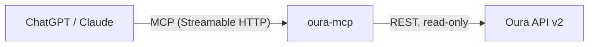

# oura-mcp

[](https://github.com/Rajskij/oura-mcp/actions/workflows/ci.yml)
[](https://github.com/Rajskij/oura-mcp/pkgs/container/oura-mcp)
[](LICENSE)
[](package.json)

**Ask your Oura Ring anything. In ChatGPT or Claude, in any language.**

A remote MCP server that connects Oura Ring data to any MCP client. No UI, no app, no model of its own: the assistant you already pay for calls the tools and explains your data in whatever language you speak.

> **You:** how did I sleep this week?
>
> **ChatGPT:** Your week was uneven, averaging 65/100. Best night was June 29 (77) with strong deep sleep. The rough one was July 2 (47): little REM, low efficiency, and your bedtime drifted way off schedule. The main pattern to fix is sleep timing.

## How it works



One small Node.js process. The client model picks the right tools, the server returns compact, pre-shaped JSON, the model does the talking.

## Tools

| Tool | Ask things like |
|---|---|
| `oura_get_sleep` | "How did I sleep this week?" |
| `oura_get_sleep_detail` | "When did I fall asleep? How much deep sleep? Night heart rate?" |
| `oura_get_readiness` | "Should I train today? Is my temperature elevated?" |
| `oura_get_activity` | "How many steps and calories yesterday?" |
| `oura_get_stress` | "How stressed was I on Monday?" |
| `oura_get_vitals` | "What's my SpO2, VO2 max, cardiovascular age?" |
| `oura_get_workouts` | "How was my run? Did I meditate this week?" |
| `oura_get_tags` | "Did coffee affect my sleep?" (reads tags you log in the Oura app) |
| `oura_get_heartrate` | "What was my pulse this afternoon?" (hourly aggregates) |
| `oura_get_profile` | "How charged is my ring?" |

All tools are read-only and marked with `readOnlyHint`, so ChatGPT does not nag you for confirmation on every call.

## Designed for LLMs, not for dashboards

- **Task-oriented tools, not 1:1 endpoint wrappers.** 18 Oura endpoints grouped into 10 tools that match how people actually ask questions.
- **Token-efficient responses.** Durations converted to minutes server-side, units baked into field names (`deep_min`, `efficiency_pct`), raw time series and internal IDs stripped. A tool response is 0.2–3 KB, not 50.
- **`response_format: concise | detailed`** on data-heavy tools. Concise by default, breakdowns on demand.
- **Actionable errors.** A too-wide heart rate query returns "ask for 3 days or less, or use oura_get_readiness for trends", not a 400.
- **Sane defaults.** Every tool works with zero arguments (last 7 days).

## Self-hosting

You need an Oura Ring with an active subscription and any host with HTTPS (a free-tier VM behind Caddy works fine).

### Docker (recommended)

```bash
# 1. Register an OAuth app at cloud.ouraring.com
#    Redirect URI: http://localhost:8888/callback

# 2. Configure
curl -O https://raw.githubusercontent.com/Rajskij/oura-mcp/main/docker-compose.yml
curl -o .env https://raw.githubusercontent.com/Rajskij/oura-mcp/main/.env.example
# fill in .env: client id/secret, generate MCP_PATH_SECRET (openssl rand -hex 24)

# 3. Connect an Oura account (one-time browser consent on this machine)
docker compose --profile setup up get-token

# 4. Run
docker compose up -d
```

Keep `PORT=3000` in `.env` (or adjust the compose port mapping to match).

### Node, no Docker

Needs Node 22+.

```bash
# 1. Register an OAuth app at cloud.ouraring.com
#    Redirect URI: http://localhost:8888/callback

# 2. Configure
cp .env.example .env   # fill in client id/secret, generate MCP_PATH_SECRET

# 3. Connect an Oura account (one-time browser consent)
npm install
npm run get-token

# 4. Run
npm run dev
```

Then add the connector in ChatGPT (Settings → Apps → Developer mode) or Claude (Settings → Connectors) pointing at `https://your-host/mcp/<MCP_PATH_SECRET>`.

Want to hack on it without a ring? `OURA_SANDBOX=1 npm run dev` serves Oura's sandbox data, no account needed.

## Privacy

- Tokens never leave your server; the MCP client only sees tool results.
- Read-only OAuth scopes. The Oura API has no write endpoints, and neither does this server.
- Your email is never returned by any tool.
- The optional usage log records tool names and timings only, never health values.

## Status

Phase 1: single-user, self-hosted. Works today, runs my household's ring.

Phase 2 (if real demand shows up): hosted multi-tenant with one-click Oura OAuth, so non-technical people can connect without deploying anything. Open an issue if you want this to exist.

## License

[MIT](LICENSE)
