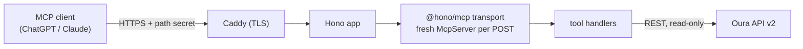

# Architecture

This document is a map for someone about to change the code: where things live,
which properties the codebase promises to keep, and why the load-bearing
decisions were made — including what each one costs.

## Bird's Eye View

oura-mcp turns Oura Ring data into something a chat model can reason about. It
is a remote MCP server: ChatGPT or Claude calls tools over Streamable HTTP, the
server fetches from the Oura REST API, shapes the response, and returns compact
JSON. The server deliberately owns only the *shaping* layer — aggregation,
unit conversion, field pruning. Interpretation ("your sleep timing drifted")
belongs to the client model, which is better at it and speaks the user's
language.

The process is stateless: every POST builds a fresh `McpServer` + transport
pair, and no request leaves state behind. The only persistent state anywhere
is one OAuth token pair on disk. There is no database, no session store, no
cache — at one user, each of those would be a liability, not a feature.

## Code Map

**`src/index.ts`** — the entry point and the only Node-specific file:
transport wiring, route table, process-level safety net.
*Invariant:* the secret URL path is never logged, here or anywhere else.
*Invariant:* GET/DELETE on the MCP path return 405 — in stateless mode there
are no sessions to resume, and letting the transport open an SSE stream on GET
would silently change the server's contract.

**`src/server.ts`** — `buildServer()`, the **API boundary** between transport
and domain. Takes no arguments, knows nothing about HTTP.
*Invariant:* transport-agnostic — this is what lets three entries share it:
`src/index.ts` (remote HTTP on a Node host), `src/stdio.ts` (local, for
Claude Desktop and the `.mcpb` bundle), and `src/worker/` (Cloudflare Workers).

**`src/worker/`** — the Cloudflare Workers entry. Same Hono routes as the Node
HTTP entry, but tokens live in a Durable Object (`OuraTokensDO`) instead of a
file, and the OAuth consent redirect returns to `/oauth/callback` on the worker
instead of localhost. *Invariant:* token refresh is serialized — Oura rotates
the refresh token on every use, and the DO's single-threaded execution makes a
two-concurrent-refreshes race (which would invalidate the token family)
structurally impossible. The provider exposes a `setAccessTokenProvider` seam so
this runtime supplies tokens from the DO instead of the filesystem.

**`src/tools/`** — the product. Ten task-oriented tools grouped by the
questions people ask, not by Oura's eighteen REST resources.
*Invariant:* every tool is read-only and declares `readOnlyHint: true`
(ChatGPT treats unannotated tools as writes and asks for confirmation on
every call).
*Invariant:* responses stay within a few KB — aggregation happens server-side
because clients cap tool results (~25k tokens) and raw heart-rate series
would blow the budget.
*Invariant:* no tool ever returns the account email.
*Invariant:* every tool works with zero arguments (defaults to the last
7 days).

**`src/providers/oura.ts`** — **the only module that talks to Oura.** The
module boundary is the codebase's single concession to a possible
multi-provider future.
*Invariant:* upstream failures are translated into messages a model can act
on — 401 becomes "token expired, reconnect", 403 becomes "no active Oura
subscription", 429 becomes "rate limited, try later". A model that receives
a bare status code relays confusion; one that receives instructions relays
instructions.

**`src/providers/oura-tokens.ts`** — token persistence (`data/tokens.json`,
mode 600). *Invariant:* tokens never appear in logs, tool results, or error
messages. Oura rotates the refresh token on every use, so exactly one server
instance may own this file — two copies racing each other invalidate the
grant (documented in the README's troubleshooting).

**`src/config.ts` / `src/env.ts`** — environment access with lazy
validation. Importing any module has no side effects (unit tests need no
env); the server still fails fast at boot via `assertConfig()`.

**`src/tools/logger.ts`** — optional usage log. *Invariant:* metadata only
(tool name, latency, error flag, response size) — never argument values,
never health data.

**`scripts/`** — `get-token.ts` (one-time browser OAuth consent),
`smoke.ts` (boots the built artifact against Oura's sandbox and drives the
real MCP surface: tools/list, `readOnlyHint` on all ten tools, a live
tools/call, 404 on a wrong path, 405 on GET/DELETE, 202 on notifications).

**`deploy/`** — the production box as code: idempotent `bootstrap.sh`,
systemd units, OCI Vault secret injection, and the Caddyfile template that
CI owns (hand edits on the box are overwritten by the next deploy).

## Key Decisions

**Official MCP SDK + Hono, no framework sugar.**
*Why:* Hono speaks web-standard Request/Response on every runtime, which is
what keeps one codebase portable to Workers and stdio; convenience wrappers
(FastMCP and friends) lag the MCP spec exactly where it moves fastest.
*Cost:* more hand-wiring than a batteries-included framework — visible in
`index.ts`.

**Stateless: fresh server + transport per POST.**
*Why:* nothing to resume, nothing to leak between requests, and it matches
the SDK's own security guidance for stateless deployments.
*Cost:* per-request construction overhead — irrelevant at personal scale,
measurable if this ever served real traffic.

**`@hono/mcp` transport instead of a Node req/res bridge.**
The first implementation bridged Hono to the SDK's Node transport via
`fetch-to-node`. It worked — until a client that closed its connection
immediately after a response left a deferred timer writing to an
already-closed stream controller: an uncaught `ERR_INVALID_STATE` thrown
from a timer, off any request stack, killing the whole process. Observed in
production, reproduced, and fixed by replacing the bridge with `@hono/mcp`,
which speaks web-standard streams and tolerates post-close writes.
*Cost:* the transport is a third-party reimplementation of the spec rather
than the SDK's own code, and it signals protocol errors by throwing
`HTTPException` — which the app's `onError` must pass through instead of
masking as a 500. A narrowly-scoped `uncaughtException` guard remains as a
belt-and-suspenders net for that one error class; everything else still
crashes loudly, as it should.

**A URL path secret instead of OAuth between client and server.**
*Why:* phase 1 serves one voluntary user with read-only data. A spec-grade
OAuth authorization server (dynamic client registration, PKCE, consent,
token storage) is most of the complexity of a multi-tenant product that no
one had asked for. ChatGPT and Claude custom connectors offer exactly two
auth modes — full OAuth or none — so a long random path is the only
zero-infrastructure control available.
*Cost:* the URL is a bearer credential. It can't be scoped or expired, and
it leaks into any log that records request URIs — which is why Caddy's logs
hash the URI (see below). Right for one user; wrong for many.

**Task-oriented tools with server-side shaping.**
*Why:* models choose tools by reading descriptions against the user's
question. "how did I sleep?" maps cleanly onto `oura_get_sleep`; it maps
poorly onto a choice among four sleep-related REST endpoints. Shaping
(seconds→minutes, units in field names, time series dropped or aggregated)
keeps responses small enough that the model can hold a week of data in
context.
*Cost:* an opinionated layer to maintain, and power users lose fields the
pruning discards. `response_format: detailed` is the escape hatch.

**No database; tokens on disk, secrets in OCI Vault.**
*Why:* the entire persistent state is one token pair. The box pulls secrets
from OCI Vault into tmpfs at service start via instance principal — nothing
secret sits on disk, and rotation is "update the vault, restart the unit".
*Cost:* single-instance by construction; any future multi-user story starts
with replacing this layer wholesale (known, accepted).

**Self-host distribution — explicitly not a hosted service.**
*Why:* Oura's API & MCP Agreement bars an "aggregator" (anyone holding other
people's Oura data and passing it to third parties) from sending that data
to any LLM, consent notwithstanding; the only sanctioned LLM path is Oura's
own MCP server; caching is barred and charging for MCP functionality is
barred. A hosted token-holding broker is unshippable without a partnership.
In the self-host model each user runs their own instance under their own
Oura app and is themselves the party to the agreement.
*Cost:* onboarding friction — every user registers an Oura OAuth app. The
README turns that requirement into what it actually is: the user's data
never depends on anyone else's infrastructure.

## Cross-Cutting Concerns

**Error handling.** Three tiers: protocol errors (bad Accept, unparseable
body) surface as the transport's own 4xx JSON-RPC responses; tool-level
failures return `isError` text written for a model to relay; unexpected
errors become a generic JSON-RPC 500 with the detail kept server-side.

**Testing.** Unit tests cover the pure shaping helpers. The smoke test is
the real gate: it boots the built artifact and exercises the wire protocol
end to end against Oura's sandbox. There is deliberately no mocked-HTTP
integration suite — the smoke covers the same surface against a truer
double at lower maintenance cost.

**CI/CD.** Every PR: typecheck → lint → unit tests → prod-dependency audit →
build → smoke → Docker build check. Merges to main additionally deploy to
the box over SSH (artifact swap + service restart), sync the Caddy config
(validate first, reload only on change, roll back on failed reload or failed
health check), and publish a multi-arch image to GHCR. Main is PR-only.

**Observability.** `/healthz`; a scheduled uptime workflow pings every
15 minutes and opens a GitHub issue after three consecutive failures; the
usage log records call metadata for tool-design feedback.

**Log hygiene.** The path secret means request URIs are sensitive. Caddy's
default logger is configured with a `request>uri hash` filter, so even a 502
error entry — which logs the full request — records an 8-hex hash instead of
the secret. This was retrofitted after watching a real 502 write the secret
to the journal; see "What I'd do differently".

## Security Posture

**Threat model:** an internet-facing endpoint whose assets are one person's
OAuth token pair and their health data in transit. The attacker of interest
is an opportunistic scanner or a leaked-URL holder, not a nation state.

**Mitigations:** TLS via Caddy/Let's Encrypt; a 48-hex-char path secret;
read-only OAuth scopes; tokens with file mode 600 on a single-user box;
secrets held in OCI Vault and materialized only into tmpfs; no health values
in any log; URI hashing in proxy logs; artifact-based deploys with pinned
host keys.

**Non-goals:** multi-tenancy, client identity, rate limiting, storing
health history. These are not missing features; they are declined scope —
each would enlarge the attack surface to protect data the server
deliberately does not hold.

**Accepted risk:** the path secret is a bearer credential in a URL. A leaked
URL grants read access to one account's data until rotated (change
`MCP_PATH_SECRET` in the vault, restart the service, update the connector).

## What I'd Do Differently

- **Start on `@hono/mcp`.** The fetch-to-node bridge passed every happy-path
  test and then died in production on a disconnect race. The lesson is not
  "that library is bad" — it's that stream-bridging code needs its failure
  modes exercised (abrupt client disconnects) before it ships, not after.
- **Design the logging story around the secret from day one.** The path
  secret was always going to end up in some log somewhere; URI hashing was
  retrofitted only after a 502 demonstrated it. Any bearer-in-URL design
  should come with log-redaction in the same commit.
- **Version from the first public commit.** Releases and a changelog are
  being added after the fact; starting at v0.1.0 with the repo's first
  public push would have cost nothing.
- **Question the provider boundary.** `providers/oura.ts` exists to make a
  second provider cheap — but there is no second provider, and speculative
  seams have carrying costs. It stays because it also isolates error
  mapping, but it was added for the weaker reason.
